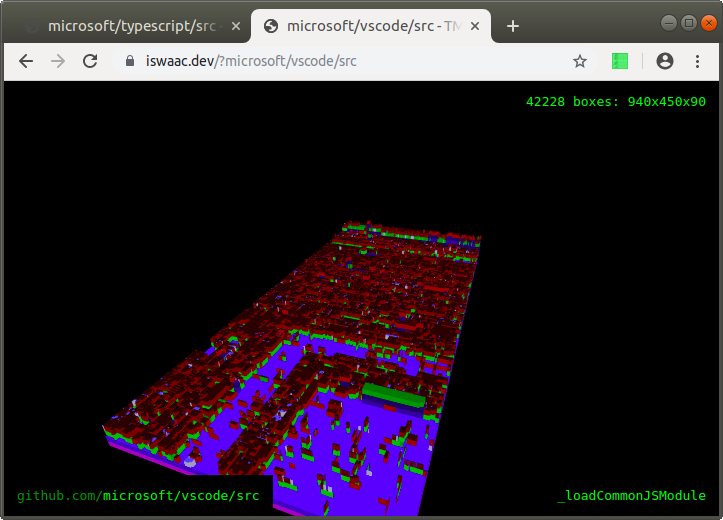

# iswaac v1

_A picture is worth a thousand words._

Software visualization is an interesting topic that deserves more attention. We often have a vague idea about how software looks and usually resort to high level diagrams and wordy descriptions. We don't have tools that would give us an aerial view of software so we could instantly spot places that look off. I'd argue that modern software looks a lot like a city: services are like city blocks, classes are like buildings, overly complex methods are like very tall steeples on those buildings and dependencies between these components are like underground pipes connecting the buildings. This idea [isn't new](https://datavizcatalogue.com/blog/3d-treemaps-that-use-extrusion/), but it's definitely worth more attention.

I've made a sketch of this idea and connected the TypeScript Compiler API with d3.treemap, three.js and WebGL:

```
  TS Compiler API
        V
  *.ts ----> AST ---> d3.treemap
              ^           |
              | ?         |
  *.java -----+           V
                     (x,y,z) boxes
                       3d.json
                          |
                          |
                          v
                        WebGL
```

The AST format is meant to be language agnostic and the rest of the rendering pipeline doesn't know whether it renders JS or C++.

I've tried this on the [vscode](https://github.com/Microsoft/vscode) project. The [result](https://iswaac.dev/?microsoft/vscode/src) looks interesting:



The surface area corresponds to the size of the component: a file size in bytes or the length of a function body. From this picture, it seems vscode has 500 KB of TypeScript sources. Height corresponds to complexity, or rather the depth of the AST, to be precise. The tallest place in vscode corresponds to a function called `formatHSLA`. The v1 doesn't inspect function bodies, but if it did, we'd see tall towers of nested for loops and callbacks inside other callbacks. Colors denote types: files have one color, classes another and so on.
