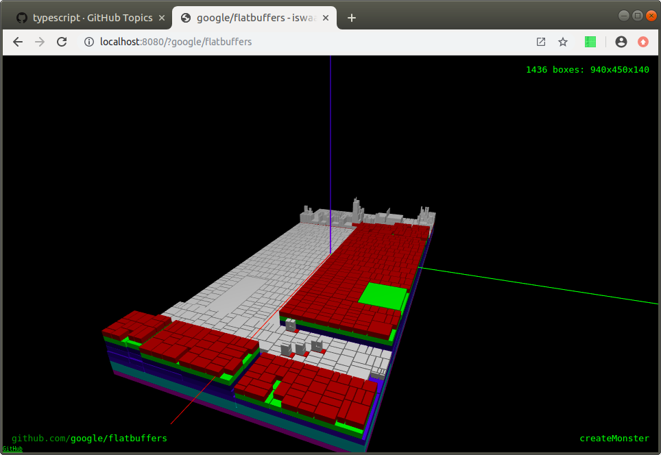
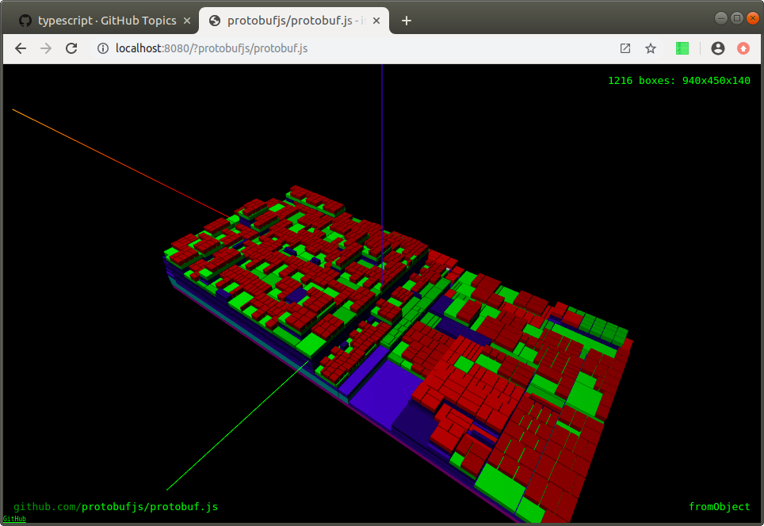
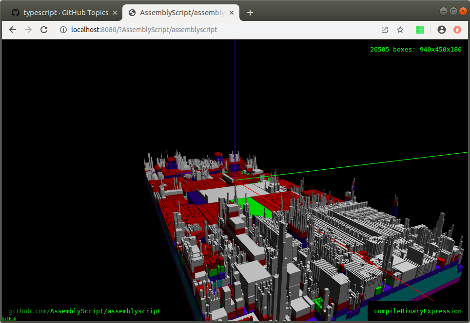
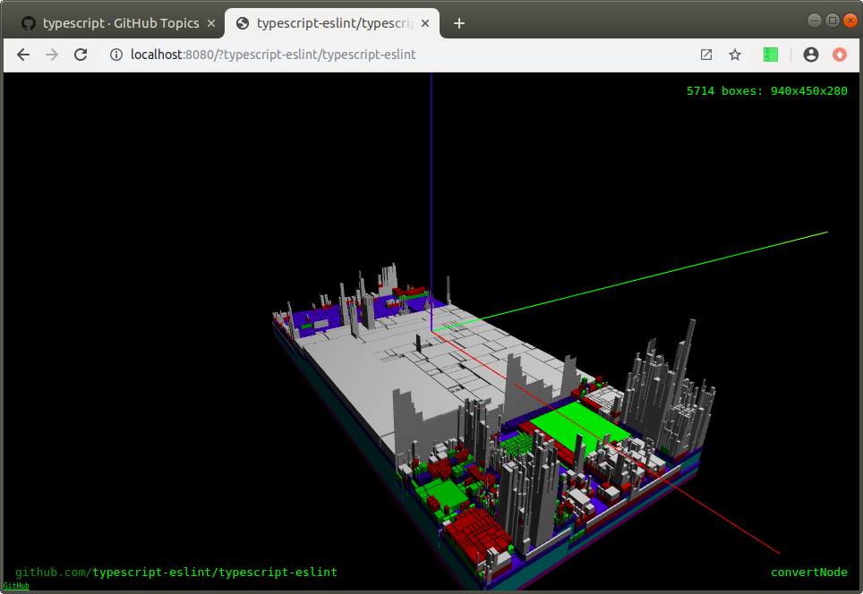
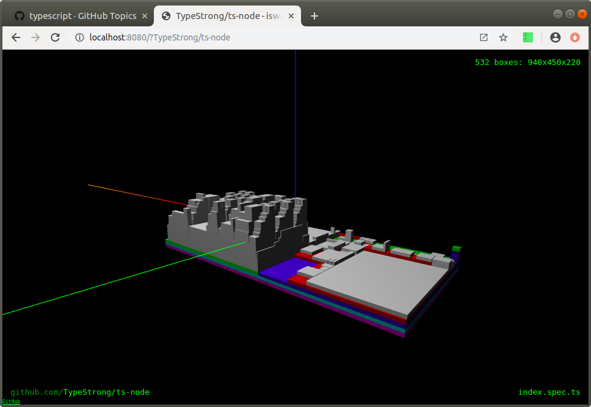
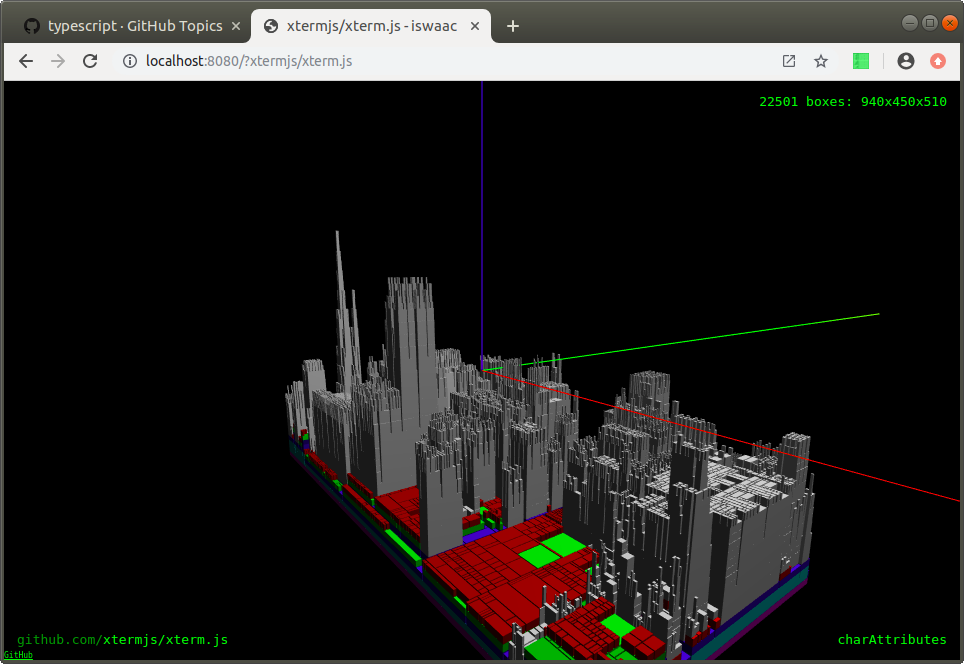

# Rendering if/for/while clauses

I've moved most of the supporting libraries into a CLI:

```bash
npm install iswaac
iswaac https://github.com/facebook/react /tmp/iswaac
```

This CLI is used by the server, so the dependency tree looks like this:

```
ast-typescript --> iswaac/cli --> iswaac/srv
                       ^              |
                       |              v
treemap-ast -----------+          iswaac/web
                       ^
                       |
webgl-3d-treemap  -----+
```

The v2 inspects nested while/for/if clauses and generates a much bigger AST. The CLI can generate a 3D treemap layout in under a minute even for very complex projects like vscode, but WebGL chokes on scenes with 50K+ boxes. I couldn't get it to render vscode or typescript projects. Still, there are a few noteworthy results below.

The `google/flatbuffers` sources look [really flat](https://iswaac.dev?google/flatbuffers):



`protobuf/protobuf.js` is slightly more complex, but still has very few nested loops:



`AssemblyScript/AssemblyScript` looks like Manhattan:



So is `eslint` with a few blocks of high complexity:



`ts-node` has this `index.spec.ts` tall block, with probably tests:



And `xterm` freely uses 10-levels deep code blocks:



Although WebGL clearly struggles to render complex scenes, it's possible to render such scenes without any 3D engines: boxes can be trivially projected into the camera with a couple matrix multiplications.
