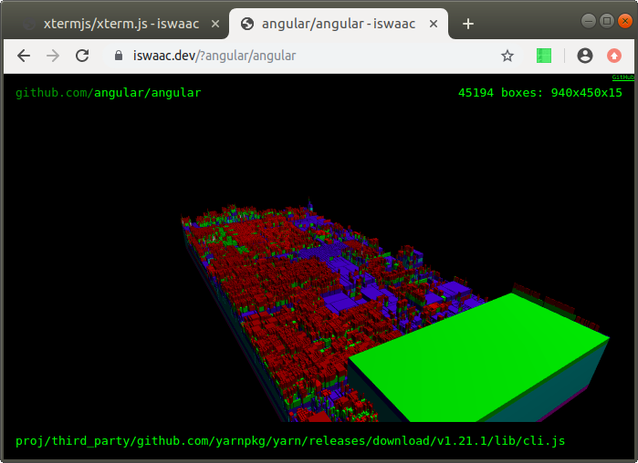
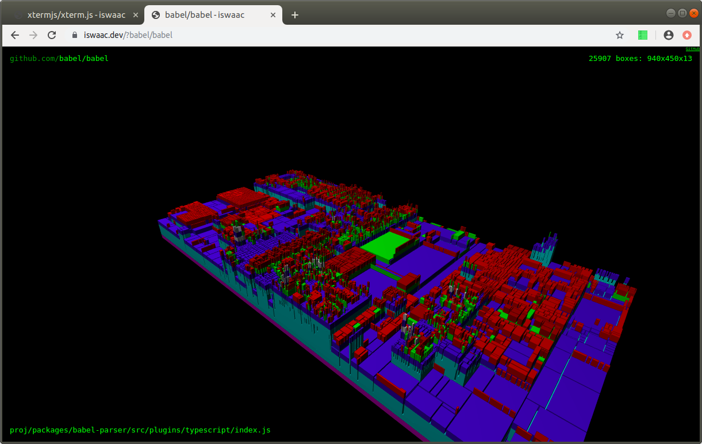
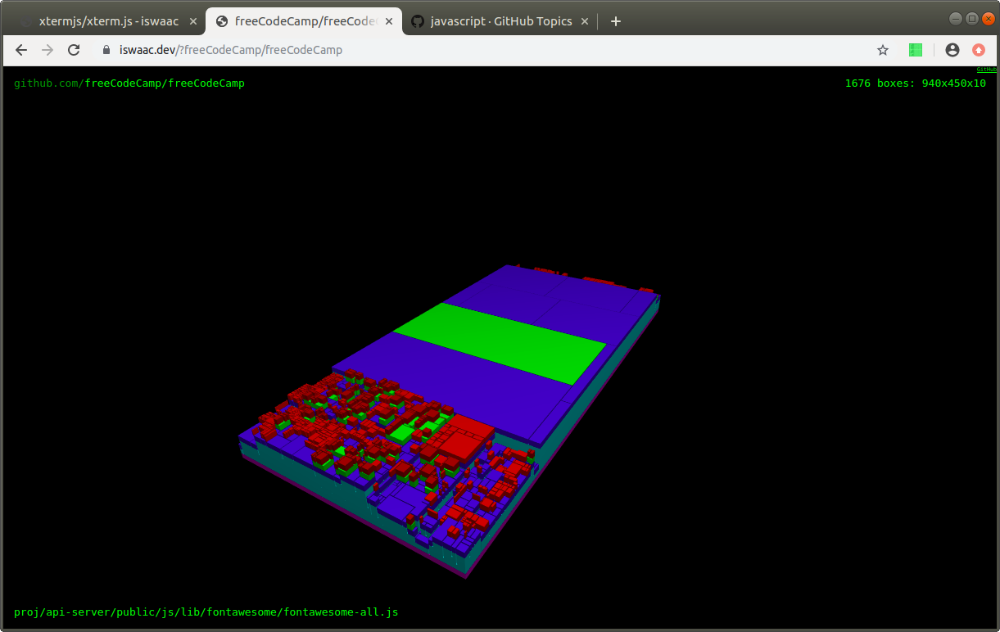
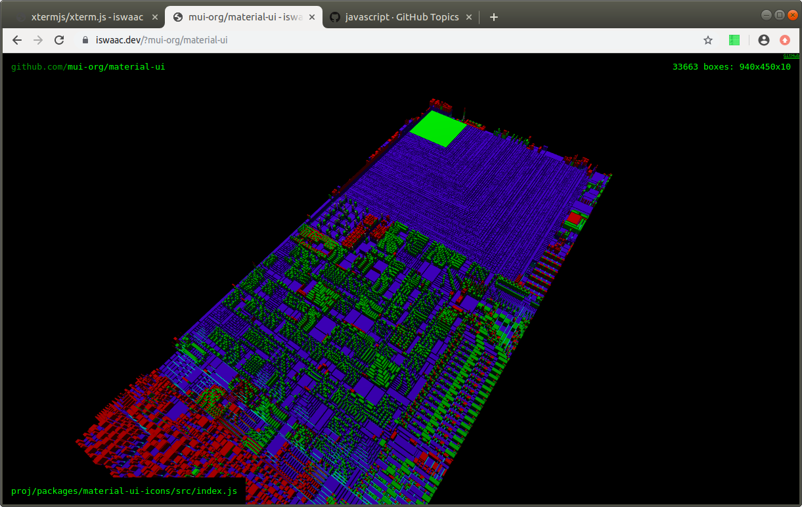
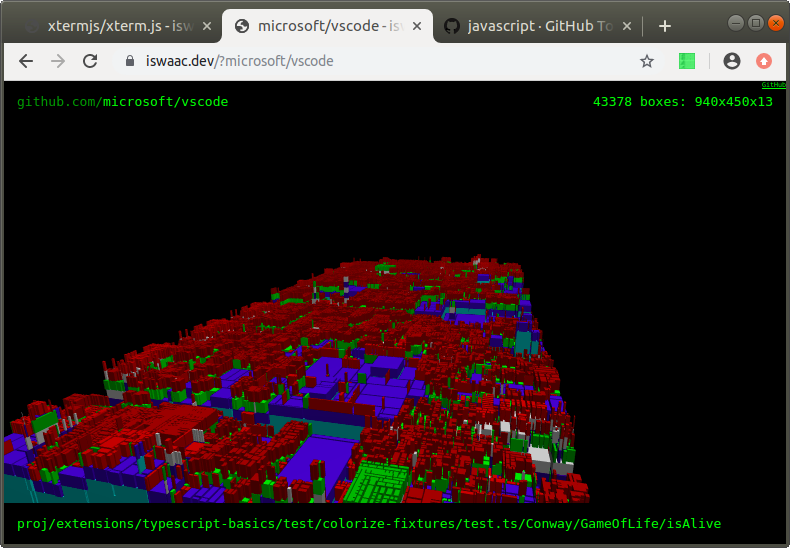

# Speeding things up with mount tmfs

`api.iswaac.dev` runs on a $5/month VPS with 1 GB RAM. It's not particularly fast, but with a couple simple tricks, it's been able to parse any JS/TS project, as long as it could `git clone` it into 256 MB (and yes, a few projects were too fat for that even with `--depth 1`).

First, the temp `git clone` dir becomes much faster if it's emulated in memory:

```bash
TMP_DIR=/tmp/iswaac/task;
TMP_DIR_SIZE=256m;
mount -t tmpfs -o size=$TMP_DIR_SIZE tmpfs $TMP_DIR;
``` 

Second, the TypeScript Compiler API is very memory hungry, so it's often not possible to load the entire project, but loading 256 ts/js files at a time works just as well. No extra caps were necessary as NodeJS/V8 GC kept memory usage under 500 MB.

`angular/angular`:



`babel/babel`:



`freeCodeCamp/freeCodeCamp`:



`mui-org/material-ui`:



`microsoft/vscode`:


