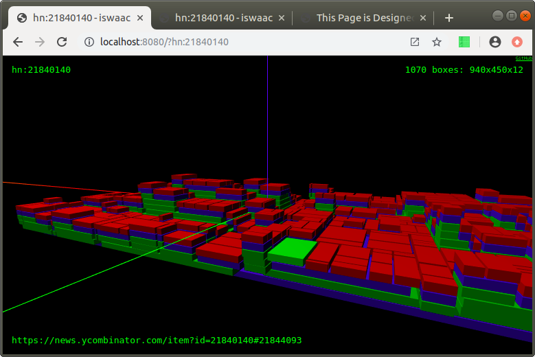
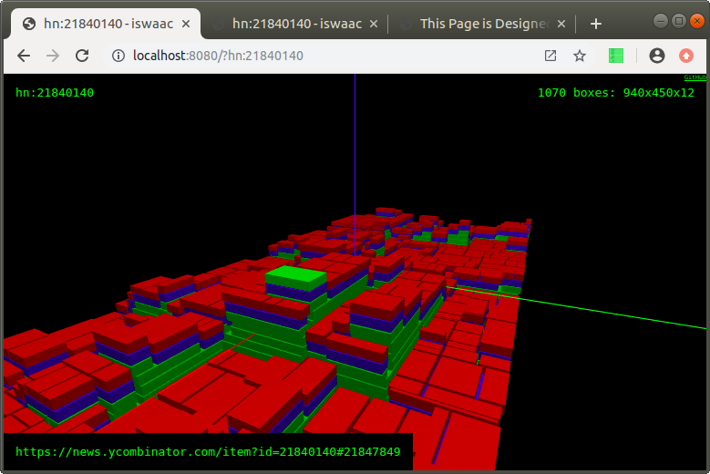

# Rendering comments from HackerNews

Comment trees can be rendered as treemaps too. Here I replaced the TypeScript parser with a html parser that downnloads and reads the HN comments. Most of the dicussions rarely cross the 500 comments mark, so I've split every comment node into paragraph nodes, to make the final image look more interesting.

- Red = paragraph.
- Blue = comment text.
- Green = comment node, that includes other comment nodes.

See it in action: https://iswaac.dev/?hn:21840140
